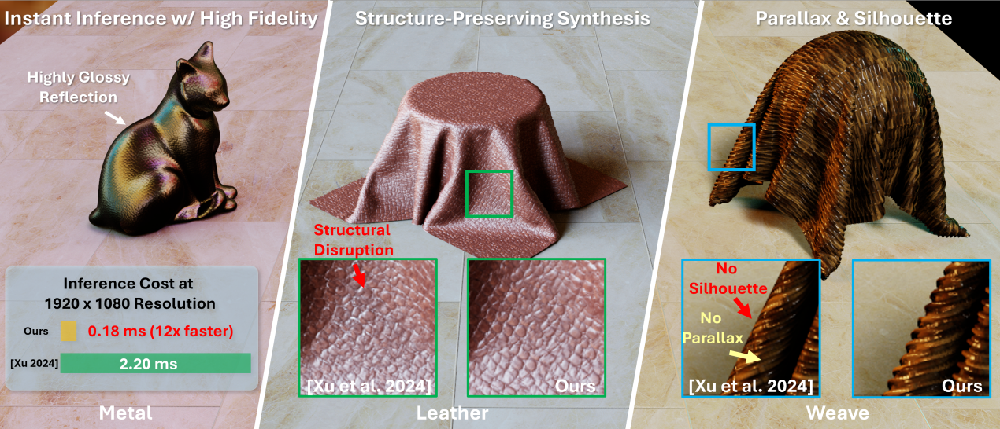
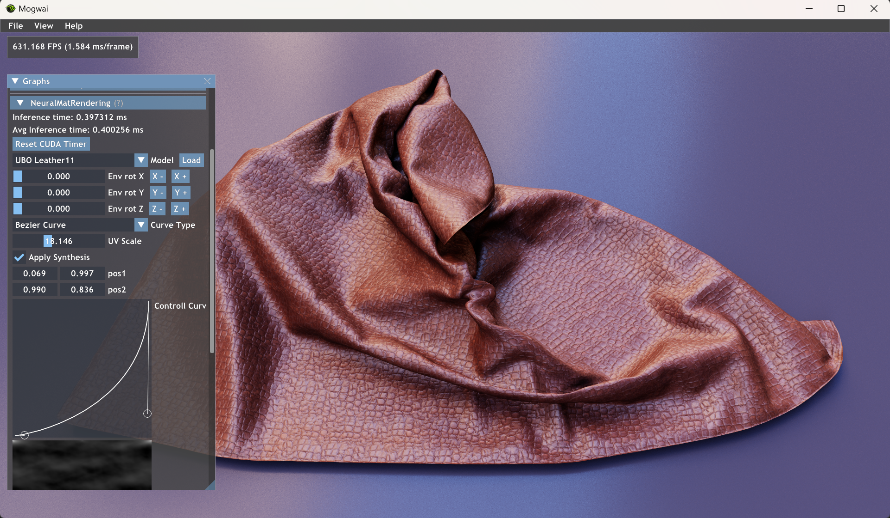

# Comprehensive Neural Materials

This repository provides an open-source implementation of our paper: Towards Comprehensive Neural Materials: Dynamic Structure-Preserving Synthesis with Accurate Silhouette at Instant Inference Speed. The code is only for reference purposes.
The core implementation is under `Source/Falcor/Utils/Neural/cuda`. 

## Prerequisites
- Windows 10 version 20H2 (October 2020 Update) or newer, OS build revision .789 or newer
- Visual Studio 2022
- [Windows 10 SDK (10.0.19041.0) for Windows 10, version 2004](https://developer.microsoft.com/en-us/windows/downloads/windows-10-sdk/)
- A GPU which supports DirectX Raytracing, such as the NVIDIA Titan V or GeForce RTX
- NVIDIA driver 466.11 or newer
- CUDA

## How to build
Our implementation is built upon the latest Falcor 8.0. Therefore, as a first step, please build Falcor 8.0 by following the official build guide below.

### 1. Building Falcor
Falcor uses the [CMake](https://cmake.org) build system. Additional information on how to use Falcor with CMake is available in the [CMake](docs/development/cmake.md) development documetation page.

#### Visual Studio
If you are working with Visual Studio 2022, you can setup a native Visual Studio solution by running `setup_vs2022.bat` after cloning this repository. The solution files are written to `build/windows-vs2022` and the binary output is located in `build/windows-vs2022/bin`.

#### Visual Studio Code
If you are working with Visual Studio Code, run `setup.bat` after cloning this repository. This will setup a VS Code workspace in the `.vscode` folder with sensible defaults (only if `.vscode` does not exist yet). When opening the project folder in VS Code, it will prompt to install recommended extensions. We recommend you do, but at least make sure that _CMake Tools_ is installed. To build Falcor, you can select the configure preset by executing the _CMake: Select Configure Preset_ action (Ctrl+Shift+P). Choose the _Windows Ninja/MSVC_ preset. Then simply hit _Build_ (or press F7) to build the project. The binary output is located in `build/windows-ninja-msvc/bin`.

Warning: Do not start VS Code from _Git Bash_, it will modify the `PATH` environment variable to an incompatible format, leading to issues with CMake.
<!-- 
#### Linux
Falcor has experimental support for Ubuntu 22.04. To build Falcor on Linux, run `setup.sh` after cloning this repository. You also need to install some system library headers using:

```
sudo apt install xorg-dev libgtk-3-dev
```

You can use the same instructions for building Falcor as described in the _Visual Studio Code_ section above, simply choose the _Linux/GCC_ preset. -->

#### Configure Presets
Falcor uses _CMake Presets_ store in `CMakePresets.json` to provide a set of commonly used build configurations. You can get the full list of available configure presets running `cmake --list-presets`:

```
$ cmake --list-presets
Available configure presets:

  "windows-vs2022"           - Windows VS2022
  "windows-ninja-msvc"       - Windows Ninja/MSVC
  "linux-clang"              - Linux Ninja/Clang
  "linux-gcc"                - Linux Ninja/GCC
```

Use `cmake --preset <preset name>` to generate the build tree for a given preset. The build tree is written to the `build/<preset name>` folder and the binary output files are in `build/<preset name>/bin`.

An existing build tree can be compiled using `cmake --build build/<preset name>`.

### 2. Test whether Falcor has been built successfully
After completing the Falcor build, you can verify that it runs correctly by launching **Mogwai**.

1. Go to **File/Load Script** and select `scripts/MinimalPathTracer.py`.
2. Then go to **File/Load Scene** and load any scene to test (for example, `media/test_scenes/cornell_box.pyscene`).

If the build is successful, you should see the rendering running as expected.

Since our implementation relies on the CUDA API, we also need to ensure that CUDA is correctly recognized by Falcor and can be used properly.

You can verify this by running the `CudaInterop` sample program.

### 3. Prepare the Neural Material Assets

1. Please download `neural_materials.zip` from: https://mbzuaiac-my.sharepoint.com/:u:/g/personal/zilin_xu_mbzuai_ac_ae/IQBR4SAyLq5TT52_SvFhIIjVAfsw2S-KKNcvHFdUSORolXw?e=xAJfGS *If the link is no longer available, please contact the author.


2. Extract the zip file and copy the `neural_materials` folder into the `media` directory. The correct directory structure should look like:
```
media/
├── ...
└── neural_materials/
    ├── heightmaps
    └── ...
```
### 4. Load and run the demo

Launch **Mogwai**, then
1. Go to **File/Load Script** and select `media/neural_materials/NeuMat.py`.
2. Then go to **File/Load Scene** and load a scene from `media/neural_materials/scene/`.



We provide multiple scenes and six neural materials. You can freely select them in the GUI.

After switching scenes, please click the **Reset Envmap** button to refresh the envmap importance sampling map.

## Potential Issue: Frame Rate Locked

In some cases, the frame rate may appear to be locked or capped. This is most likely caused by V-Sync settings. Unfortunately, Falcor's internal V-Sync setting seems not working.

You may need to disable V-Sync globally in the NVIDIA Control Panel or the NVIDIA App.